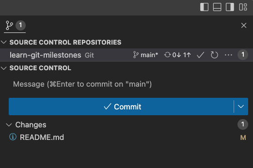
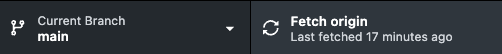
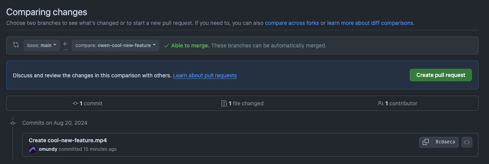

<!-- 
 -->

# Git Milestones

An introduction to Git and Github.

- [PART 1 - Git Basics](#part-1---git-basics)
- [PART 2 - Git Collaboration](#part-2---git-collaboration)

## Instructions

1. Complete the below steps, adding content in the [completions](#completions) table when prompted with ✏️ 
1. Review course content as needed. You may need to read the documentation as well.
1. Insert your own class name when prompted, for example: `critical-web-design`
1. After you finish, celebrate your Git proficiency! 🙌


# PART 1 - Git Basics

Install, configure, and perform basic operations while creating a simple website


## 1. Install Git

1. Complete the [Command Line Crash Course](https://github.com/omundy/learn-computing/blob/main/topics-command-line.md#crash-course) to prepare to install Git on your machine.
<!-- https://gist.github.com/derhuerst/1b15ff4652a867391f03 -->

2. Install Git for either Mac or Windows:

<details>
<summary>Windows</summary>

<ol>
<li>Download the installer at <a href="https://gitforwindows.org/" target="_blank">gitforwindows.org</a></li>
<li>Run the installer. Use the default settings but make sure to install <a href="https://www.atlassian.com/git/tutorials/git-bash" target="_blank">Git BASH</a></li>
<li>Proceed to "Configure Git"</li>
</ol>

</details>


<details>
<summary>Mac</summary>

Install Git with Homebrew using these instructions:

<ol>
<li>Copy and run this whole line to Install the <a href="https://brew.sh/" target="_blank">homebrew package manager</a>. If prompted to "Install Command Line Developer Tools?", choose <code>yes</code>. When entering passwords the Terminal doesn't show your typing. Backspace several times if you make a mistake.<br>

```bash
/bin/bash -c "$(curl -fsSL https://raw.githubusercontent.com/Homebrew/install/HEAD/install.sh)"
```
</li>
<li>Confirm installation:<br>

```bash
brew --version
```
</li>
<li>Then install git using homebrew:<br>

```bash
brew install git
```
</li>
</ol>

</details>


## 2. Configure Git

1. Verify Git is installed by outputing the current version.

```bash
git --version
# -> git version 2.38.1
```

2. Check to see if Git is already configured. If the following returns `"No such file or directory"` then continue to the next step.

```bash
cat ~/.gitconfig
```

3. Add your name (replace with ***your*** information, press return after each line)

```bash
git config --global user.name "Your Name"
```

4. Add your email

```bash
git config --global user.email youraddress@example.com
```

5. Set the [default branch to main](https://www.theserverside.com/feature/Why-GitHub-renamed-its-master-branch-to-main)

```bash
git config --global init.defaultBranch main
```

6. Set pull to merge ([not rebase](https://stackoverflow.com/a/36587353/441878))

```bash
git config --global pull.rebase false
```

7. Confirm your global settings worked

```bash
cat ~/.gitconfig
```


## 3. Markdown Introduction

Markdown is a lightweight markup language for creating rich text.

- It has a [simple syntax](https://www.markdownguide.org/cheat-sheet/) similar to [HTML](https://en.wikipedia.org/wiki/Markdown#Example)
- It is the standard language for formatting README files (what you are currently viewing!)
- Files use the `.md` extension and can be edited with any plain text editor (e.g. VS Code).
- Preview using the VS Code or the [Markdown Viewer](https://chrome.google.com/webstore/detail/markdown-viewer/ckkdlimhmcjmikdlpkmbgfkaikojcbjk/related?hl=en) browser extension 

Markdown | HTML | Rendered Output
--- | --- | ---
`[link](https://davidson.edu)` | `<a href="https://davidson.edu">link</a>` | [link](https://davidson.edu)
`**bold text**` | `<b>bold text</b>` | **bold text**
`*italicized text*` | `<i>italicized text</i>` | *italicized text*
<code>\`code`</code> | `<code>code</code>` | `code`
`` | `` | 

🎉 Now you know basic Markdown! Continue with following instructions to learn Git, editing this `.md` file in the process. Use the [github markdown cheatsheet](reference-sheets/github-markdown-cheatsheet.pdf) to check your syntax.


<details>
<summary>Other handy Markdown tools</summary>

<ol>
<li><a href="https://euangoddard.github.io/clipboard2markdown/" target="_blank">Paste (RTF or rendered HTML) to Markdown</a></li>
<li><a href="https://codebeautify.org/html-to-markdown" target="_blank">HTML to Markdown</a></li>
</ol>

</details>


## 4. Fork this repository

Now that you know markdown, create a Github account and make your first commit on Github.com

1. [Create a Github account](https://github.com/join)
1. Fork this [learn-git-milestones](https://github.com/omundy/learn-git-milestones) repository (click the Fork button, top right).
1. ✏️ Edit this `README.md` file (click the pencil icon on the Github.com page) and add your *1st* favorite emoji to the **Completed** column in appropriate row in the [completions [4-1]](#completions) section, below.
1. Commit your changes to this file to the `main` branch with the message `commit #1 from Github.com`.
1. ✏️ Use [Markdown documentation](https://guides.github.com/features/mastering-markdown/) to add a link in [completions [4-2]](#completions). The link text should be the same as the commit message, and the url should point to the Github.com page showing the above commit.
1. ✏️ Tables can be a little tricky in Markdown. Use a search engine to find a good link explaining how to use markdown tables and paste it in the [completions [4-3]](#completions) table.
1. View the commit history and confirm your edits
1. ✏️ What does `git log` do? Add your answer to [completions [4-4]](#completions).


## 5. Git Workflow > Github Desktop

With Git installed on your computer you can perform a basic Git workflow using Github Desktop. This is the first of a few different interfaces to give you practice with Git. You've already forked and made a commit on Github.com so let's move to Github Desktop ...


### Install Github Desktop

1. Install [Github Desktop](https://desktop.github.com/) on your computer
1. Connect your Github account in Github Desktop

### Clone the repository

In Github Desktop, clone the fork of this repository that you made above...

1. Select File > Clone Repository > Github.com and select it ...
1. Local Path: The default location is usually fine: `/Users/<username>/Documents/Github/` (or the equivilant on Windows). You can also use a folder specific to your class name, as long as it doesn't have spaces (e.g. `critical-web-design`)
1. Click "Clone" to finish. This will save a local copy of the repository on your computer and make it available to Github Desktop.

### Use Github Desktop with VS COde

1. Install [VS Code](https://code.visualstudio.com/) on your computer
1. In Github Desktop, open the repo in VS Code: Repository > Open in VS Code (see preferences to change your editor)
1. ✏️ In VS Code, edit this README file and add your *2nd* favorite emoji to [completions [5-1]](#completions) and save the file.
1. In Github Desktop, view/confirm your edits to the README file on the Changes tab
1. Commit your changes directly to the main branch with the message `commit #2 from Github Desktop`. 
1. Click Push origin to push your new commit to the remote repo
1. Choose Repository > View on Github.
1. Click on the README file and then click History to see the history of this file
1. Click on the above commit (`#2`) and copy the URL. Use VS Code to add it to [completions [5-2]](#completions) . Commit your change in Github Desktop.


## 6. Git Workflow > Command line 

Some folks use the CLI as their default tool for editing and publishing source code, but Github Desktop makes it much easier.

### Setup

1. In Github Desktop, ensure you are currently in the [learn-git-milestones](https://github.com/omundy/learn-git-milestones) repo you cloned above.
1. Click Repository > Open in Terminal ("Bash" in Windows?)

### Use the CLI to navigate directories

1. List files in this directory: `ls`
1. List files in this directory, including hidden: `ls -la`
1. Confirm the existence of the `.git` directory (where Git versions and config are stored)
1. View your current working directory and copy the full path: `pwd`
1. ✏️ Open this README file in VS Code and paste that path in [completions [6-1]](#completions).


### Use Git on the CLI

1. [Confirm](https://docs.github.com/en/github/using-git/setting-your-username-in-git) your name and email is correct in the Git config
1. View the status of your repo: `git status`
1. View the changed files of your repo: `git diff`
1. Add all changed files to the staging area `git add .`
1. View the status of your repo `git status` to confirm it has been staged
1. ✏️ Commit your changes with the message `commit #3 from CLI`. Add a link to this commit to [completions [6-2]](#completions).
1. Use `git push` to [push those changes to your remote repo](https://docs.github.com/en/github/using-git/pushing-commits-to-a-remote-repository)


You've used most of these already through a GUI (e.g. `git status`, `git add`, `git commit`, `git push`) ...


<!-- 
## 7. Git Workflow > VS Code

1. From Github Desktop, you can open the [learn-git-milestones](https://github.com/omundy/learn-git-milestones) repo in VS Code using: Repository > Open in VS Code
1. ✏️ In VS Code, edit this README file and add your *3rd* favorite emoji to [completions](#completions).
1. Create a new file `hello.txt`, add some text and save it.
1. Display the Git panel (click the small Git button at the bottom right).
1. Select on your file(s) in Unstaged changes and confirm your changes match what you expect to see
1. Double click on each file with changes to stage them
1. ✏️ Commit your changes directly to the main branch with the message `commit #4 from VS Code`. Add a link to this commit to [completions](#completions). 


  
-->


## 7. Create a website with Git


### Create a new repository in Github Desktop

1. Select File > New repository to create a new repository with the following... 
2. Name: `first-website`
3. Local Path: Click "Choose" and select the parent folder of the repository you cloned above (so that the new repository folder will be created next to `learn-git-milestones`, not inside of it!)

```html
<parent-folder> <-THIS!
|-- first-website 
|-- learn-git-milestones
```

4. Initialize this resository with a README? `yes`
5. Git Ignore: Select any option (we will overwrite below)
6. License: `MIT`
7. Click Create Repository


### Add a README.md

1. In Github Desktop choose Repository > Open in VS Code
1. Add a README file: `README.md`
1. In the README write your name and the date
1. Use some [Markdown tags](https://guides.github.com/pdfs/markdown-cheatsheet-online.pdf)


### Add a .gitignore file

A `.gitignore` file will prevent git from adding unwanted files to your repository.

1. In VS Code, add a new file named `.gitignore`. The period in front will hide the file from the Finder (or Explorer) but it will still be visible in VS Code.
1. Copy the contents of either the [MacOS](https://github.com/github/gitignore/blob/33243d9491911332228307c915ff95707791a91f/Global/macOS.gitignore) or [Windows](https://github.com/github/gitignore/blob/33243d9491911332228307c915ff95707791a91f/Global/Windows.gitignore) `.gitignore` files and paste it into your own.
1. Commit your changes using Github Desktop. 


### Add an index.html file

1. In VS Code, create a file named `index.html` in your new repo 
2. Add the following code

```html
<!DOCTYPE html>
<html lang="en">
	<head>
		<meta charset="utf-8">
		<title>My first github.io website</title>
	</head>
	<body>
		<h1>Hello, World!</h1>
		<p>🙌</p>
	</body>
</html>
```

3. Commit your changes using Github Desktop.


### Publish this repository on Github.

1. In Github Desktop, click "Publish this repository on Github"
1. Make sure the repository is public *not private* 
1. Click Publish Repository
1. Choose Repository > View on Github
1. ✏️ Add a link to this repo on Github to [completions [7-1]](#completions).


## 8. Publish a website with Github Pages

Now that your files are on Github you can use [Github Pages](https://pages.github.com/), a free and easy way to host a website from your repository. 

1. On Github.com, go to your repository > Settings > Pages
1. Source: Deploy from Branch
1. Branch: Select the `main` and `/(root)` folder and click Save
1. Do not use a theme. Start from scratch
1. Wait about 60 seconds and refresh the page. You will see a link at the top that says "Your site is live at..." with a URL that looks like `http://*username*.github.io/first-website`
1. Update your index.html page with VS Code, push a new commit with Github Desktop, and confirm your updates are live. You can see the status of your deployments from the link on your main repo page.
1. ✏️ Paste a link to the ***live*** (github.io) website in [completions [8-1]](#completions).


🎉 Congratulations! 🎉 You just built a website with Git and Github!!


# PART 2 - Git Collaboration

Forking, branching, pull requests


## 9. Create a branch in Github Desktop

1. Save all your work in VS Code and close your files (this is not required to switch branches, but is a good practice so you don't lose work!). There should be no changes in your repo.
2. In Github Desktop, click Fetch and then Pull to make sure you are synced with the remote



3. Click the Branch dropdown (pictured above) to see the other branches in this repo. You should see `main` (your current branch) and one other. Switch to the other branch.
4. ✏️ Look in VS Code to see the contents of the other branch. Summarize the contents of the `cool-new-feature` file in the [completions [9-1]](#completions) column.


## 10. Create a branch in Github Desktop

1. Use Github Desktop to switch back to the main branch.
1. Click Branch > New Branch... (or use the dropdown)
1. Name the branch (using no spaces or special characters) using your name + `-changes` (e.g. `owen-changes`)
1. Add a new file (a graphic or text file) with the same name to the repo.
1. Commit your changes
1. Publish your new branch and changes to the Github server
1. Open your repo on https://github.com and find the branches page.
1. ✏️ Click on your branch and paste the URL into the [completions [10-1]](#completions) column.


## 11. Create a pull request

> *A pull request (PR) is the standard method to ask another project owner to merge commits from your fork or branch into their project. Since you own this repo you walk through the process on your own.*

1. On your repo Github page, click Pull Request. 
1. Click New pull request. 
1. Compare changes between your `main` branch and your new branch. You should see at least one commit listed below, as well as any added or changed files.
1. Click Create pull request. Then add any comments and click Create pull request again.
1. On the next page, click Merge pull requests to merge the commits into your `main` branch.
1. ✏️ Click Insights > Network to see the branch flowchart of your project. Paste the link into the [completions [11-1]](#completions) below.





## 12. Suggest changes to a partner's project using a PR

1. Find a partner and discuss a small improvement to their `first-website` (or another) project (design, code, functionality).
1. Fork their repository and clone your fork to your computer.
1. Create a new branch with your name + the name of the improvement.
1. Make the improvement.
1. Commit your work to your new branch in your fork.
1. On on your fork on Github.com click Pull requests > New pull request. This will take you to their repo page where you can see a diff comparing your changes in your `fork:repo` to their base `fork:repo`. 
1. ✏️ Create the pull requst as you did above. They will receive an email to accept the change. Copy the link to the pull request to the [completions [12-1]](#completions) table.


## Turn in this Assignment

Now that we have basic Git commands out of the way use Git to create and turn in your assignment ...

1. Complete all of the items on this README, making sure all the rows in the "Completed" column contain your information below.
1. Test your file(s) in a web browser
1. Commit and push the files to Github
1. Paste the github.io link into the appropriate Moodle forum


## Completions

Row | Step | Description | Completed
--- | --- | --- | ---
1 | 4a | 1st Favorite emoji | ‼
2 | 4b | Link to `commit #1 from Github.com` | [commit #1 from Github.com](https://github.com/phanderson01/learn-git-milestones/commit/96e5ae41be4fee254f4da28dc04fafabd8bb4066)
3 | 4c | Link to markdown tables docs | [how to use markdown tables](https://github.com/omundy/learn-git-milestones/blob/main/reference-sheets/github-markdown-cheatsheet.pdf)
4 | 4d | What does `log` do? | git log lets you view the history and search for specific changes
5 | 5a | 2nd Favorite emoji | 🙏
6 | 5b | Link to `commit #2 from Github Desktop` | [commit #2 from Github Desktop](https://github.com/phanderson01/learn-git-milestones/commit/fcf805e6cbdfd5010d0437096a9f7c473fec3802) 
7 | 6a | Full path to your working directory | /Users/phoebeanderson/Documents/GitHub/game development pa/learn-git-milestones
8 | 6b | Link to `commit #3 from CLI` | [commit #3 from CLI](https://github.com/phanderson01/learn-git-milestones/commit/612f060c9e047fbcdf3eff6cba4e1b5b9f062f86)
9 | 7 | 3rd Favorite emoji | 😔
10 | 8 | Link to `commit #4 from VS Code` | [commit #4 from VS Code](https://github.com/phanderson01/learn-git-milestones/commit/75e18a1612a1dceb1ea02840b4c52f393eb3f165)
11 | 9a | Link to `first-website` github.com repo page | [first website](https://github.com/phanderson01/first-website)
12 | 9a | Link to `first-website` github.io "project site" | [first website project site](https://github.com/phanderson01/first-website)
13 | 10a | What is in Owen's dev branch? | a rickroll
14 | 10b | Link to your new branch on github.com | [new branch link](https://github.com/phanderson01/learn-git-milestones/tree/phoebe-changes)
15 | 10c | Link to your network graph | 
16 | 10d | Link to the PR you made on a partner's github.com repo |


## Resources

Here are some popular tutorials/guides. You should **still look for other ones that you might like better**!

- The Git & Github lectures found in the schedule
- Simple Git commands [cheatsheet](commands.md)
- [Github Desktop Documentation](https://docs.github.com/en/desktop) and [cheatsheet](https://github.github.com/training-kit/downloads/github-git-cheat-sheet/) ([PDF](https://github.github.com/training-kit/downloads/github-git-cheat-sheet.pdf) format)
- [Github Learning Lab](https://lab.github.com/) which contains tutorials like [Introduction to Github](https://lab.github.com/githubtraining/introduction-to-github) and others
- View forks of this repo http://gitpop2.herokuapp.com/omundy/learn-git-milestones


## Git Advanced

That is all that is required for this milestone. See the `advanced.md` file if you would like to continue learning Git.


## Credits

Thanks to [Jesse Farmer](https://github.com/jfarmer) for inspiring this milestone assignment.
